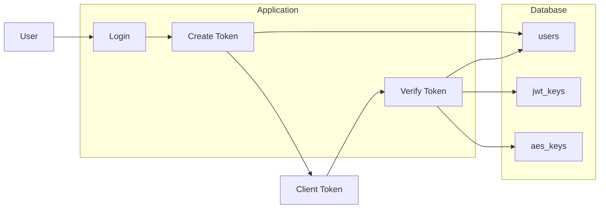

# JCJwt – Database-Backed JWT Auth with Daily Keys

MidJwt 是一套基于 **每日密钥 + 数据库存储** 的 JWT 登录验证组件，适合需要更强控制力的后端项目。  
设计思路来自实际线上项目：**每天一套签名 Key、每天一套 AES Key、JWT 内绑定设备指纹与 IP，且 Token 状态落库**。

> 目标：在不依赖任何框架的前提下，提供一套「即插即用、可配置、可审计」的登录令牌方案。

---

## Features

- ✅ **每日 JWT 签名 Key**：从数据库 `jwt_keys` 表读取当天签名 Key  
- ✅ **每日 AES Key（可选）**：Token 入库前用 AES 加密，更难被直接利用  
- ✅ **JWT 负载信息**：
  - `sub`：用户 ID  
  - `username`：用户名（Base64 包一层）  
  - `iat / exp`：签发时间 & 过期时间  
  - `jti`：唯一 Token ID  
  - `fp`：设备指纹（User-Agent + Accept + Encoding + Language + IP + 环境信息）  
  - `ip`：客户端 IP  
- ✅ **多重校验**：
  - 签名 + 过期时间  
  - 设备指纹比对（可选）  
  - IP 地址比对（可选）  
  - 可选：对比用户表中存储的加密 Token（防伪造 & 强制下线）  
- ✅ **零框架依赖**：只依赖 `mysqli` + `openssl` + 标准 PHP 函数  
- ✅ **高度可配置**：通过 `config/midjwt.php` 控制表名、字段名、安全策略等  

---

## Directory Structure

推荐的项目结构示例：

```text
your-project/
  midjwt/
    src/
      MidJwt.php          # 核心类
    config/
      midjwt.php          # 配置文件（你需要根据自己项目改这里）
    examples/
      login_example.php   # 登录成功生成 token 的示例
      guard_example.php   # 受保护页面校验的示例
  public/
    index.php
    login.php
```

在业务代码里引入：

```php
require __DIR__ . '/midjwt/config/midjwt.php';
require __DIR__ . '/midjwt/src/MidJwt.php';
```

---

## Configuration

配置文件：`config/midjwt.php`  
使用者只需要改这里的表名 / 字段名 / 策略，就可以适配自己的项目。

```php
$MIDJWT_DB = [
    'connection' => null,
    'driver'     => 'mysqli',
];

$MIDJWT_CONFIG = [
    'user_table' => [
        'name'         => 'users',
        'id_column'    => 'id',
        'username_col' => 'username',
        'token_column' => 'login_token',
        'role_column'  => 'role',
    ],

    'jwt_key_table' => [
        'name'       => 'jwt_keys',
        'key_column' => 'jkey',
        'time_column'=> 'created_at',
    ],

    'aes_key_table' => [
        'name'        => 'aes_keys',
        'key_column'  => 'akey',
        'time_column' => 'created_at',
        'enabled'     => true,
        'cipher'      => 'AES-256-CBC',
    ],

    'security' => [
        'token_ttl'        => 1800,
        'bind_fingerprint' => true,
        'bind_ip'          => true,
    ],

    'cookies' => [
        'token'  => 'token',
        'userId' => 'UserID',
    ],
];
```
---

## Usage

### 1. After Login – Generate Token

```php
$userId   = $row['id'];
$username = $row['username'];

$result = $auth->createLoginToken($userId, $username);
$jwt       = $result['jwt'];
$encrypted = $result['encrypted'];

if ($encrypted !== null) {
    $auth->storeEncryptedTokenForUser($userId, $encrypted);
}

setcookie($MIDJWT_CONFIG['cookies']['token'], $jwt, time() + 1800, '/', '', false, true);
```

### 2. Protecting Routes – Verify Token

```php
$jwt = $_COOKIE[$MIDJWT_CONFIG['cookies']['token']];
$payload = $auth->verifyRawToken($jwt);

if ($payload === false) {
    http_response_code(401);
    exit('Unauthorized');
}

$userId   = $payload['sub'];
$username = $payload['username'];
```

---

## Architecture



---

## SQL Examples

### `users`
```sql
CREATE TABLE `users` (
  `id` BIGINT UNSIGNED NOT NULL AUTO_INCREMENT,
  `username` VARCHAR(191) NOT NULL,
  `password_hash` VARCHAR(255) NOT NULL,
  `login_token` TEXT NULL,
  `role` VARCHAR(50) NULL,
  `created_at` TIMESTAMP NOT NULL DEFAULT CURRENT_TIMESTAMP,
  PRIMARY KEY (`id`)
) ENGINE=InnoDB;
```

### `jwt_keys`
```sql
CREATE TABLE `jwt_keys` (
  `id` BIGINT UNSIGNED NOT NULL AUTO_INCREMENT,
  `jkey` VARBINARY(64) NOT NULL,
  `created_at` TIMESTAMP NOT NULL DEFAULT CURRENT_TIMESTAMP,
  PRIMARY KEY (`id`)
) ENGINE=InnoDB;
```

### `aes_keys`
```sql
CREATE TABLE `aes_keys` (
  `id` BIGINT UNSIGNED NOT NULL AUTO_INCREMENT,
  `akey` VARBINARY(64) NOT NULL,
  `created_at` TIMESTAMP NOT NULL DEFAULT CURRENT_TIMESTAMP,
  PRIMARY KEY (`id`)
) ENGINE=InnoDB;
```

---

## License
MIT
